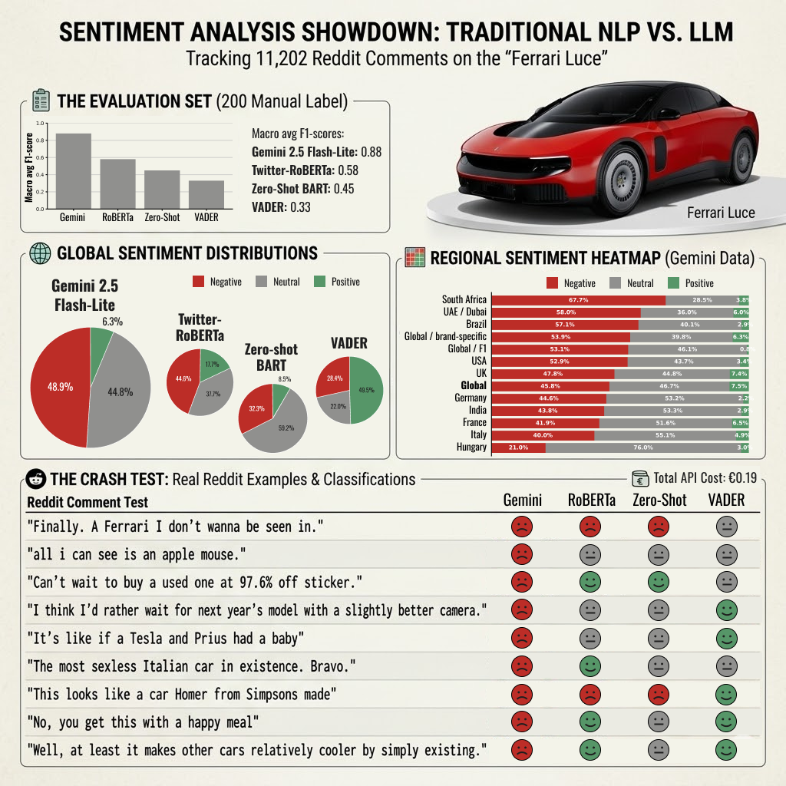

# 🏎️ Ferrari Luce Reddit Sentiment Analysis

## Overview

This project analyses Reddit reactions to Ferrari's newly revealed electric vehicle, the Ferrari Luce, using multiple NLP and LLM-based sentiment analysis approaches.

The goal was not only to estimate overall public reaction, but also to compare how different sentiment analysis methods perform on real-world social media data containing sarcasm, humour, informal language, and indirect opinions.

The project compares:

* VADER (rule-based sentiment analysis)
* RoBERTa transformer sentiment classifier
* Zero-shot classification using BART-MNLI
* Gemini 2.5 Flash Lite



[Related LinkedIn post](https://www.linkedin.com/posts/marina-kotvanova_ferrari-ferrari-datascience-share-7473400991397134336-0nku/?utm_source=share&utm_medium=member_desktop&rcm=ACoAABATHkoBUfGmKh-_eMt7WfPjD2GTF42I6LM)

# Dataset

Reddit posts and comments were collected after the Ferrari Luce release on **25 May 2026**

The final dataset contains:

* 11,000+ Reddit posts and comments
* 30+ automotive-related subreddits
* Multiple languages

Data sources included Ferrari, automotive, electric vehicle, motorsport, and regional car subreddits.

---

## Pipeline

### Data Collection

Reddit data was collected using the Reddit API (PRAW), including:

* post titles
* post text
* comments
* subreddit information
* engagement metrics
* timestamps

---

### Language processing

Non-English comments were detected and translated using DeepL before applying English-language sentiment models. The original text was preserved for Gemini analysis.

Pipeline:

```
Reddit posts/comments
          |
          v
   Language detection
          |
          +----------------+
          |                |
       English        Non-English
          |                |
          |          DeepL translation
          |                |
          +----------------+
                   |
                   v
          Sentiment analysis
```

---

## Sentiment Analysis Approaches

### VADER

A rule-based sentiment baseline. Fast and interpretable, but limited when dealing with sarcasm and context.

### RoBERTa

A transformer-based model trained on social media text `cardiffnlp/twitter-roberta-base-sentiment-latest`

### Zero-shot classification

`facebook/bart-large-mnli` used with Ferrari Luce-specific sentiment categories.

### Gemini 2.5 Flash Lite

A multilingual LLM classifier applied directly to original Reddit text. The prompt included Ferrari Luce context and instructions to consider sarcasm, humour, and indirect criticism.

---

## Evaluation

To compare model performance, 200 randomly sampled Reddit records were manually labelled as:

- positive
- negative
- neutral

The labels were used as a reference to evaluate model predictions. Macro F1-score was used because the sentiment classes were imbalanced.

---

## Key Findings

The main challenge was not detecting obvious sentiment, but understanding context. Traditional sentiment models often struggled with sarcastic or humorous comments, while the LLM-based approach performed substantially better.

---

## Limitations

- Reddit users are not representative of all Ferrari customers.
- Regional sentiment is based on subreddit/community as a proxy, not verified user location.
- Translation may introduce additional uncertainty for non-English comments.

---

## Technologies

- Python (pandas, PRAW, langdetect, matplotlib)
- NLP (NLTK VADER, Hugging Face Transformers, RoBERTa, BART-MNLI)
- APIs (DeepL, Gemini)

---

## 🛠️ Project Architecture

This project is fully self-contained within a Jupyter Notebook pipeline (`.ipynb`), structured as follows:

```
├── ferrari_luce_sentiment_analysis_figure.png    # Project figure
├── README.md                                     # Repository documentation
├── Reddit_reaction_to_Ferrari_Luce.ipynb         # Main analysis notebook
└── requirements.txt                              # Package dependencies
```

`.env` example for required API credentials:
```
APP_ID="your_reddit_client_id"
APP_SECRET="your_reddit_client_secret"
REDDIT_USERNAME="your_reddit_username"
DEEPL_API_KEY="your_deepl_auth_key"
GEMINI_API_KEY="your_google_genai_key"
```

---

# Limitations

* Reddit users are not representative of the general Ferrari audience.
* Sentiment models can struggle with highly domain-specific discussions.
* Translation introduces an additional processing step for non-English comments.
* Regional analysis uses subreddit/community as a location proxy.


